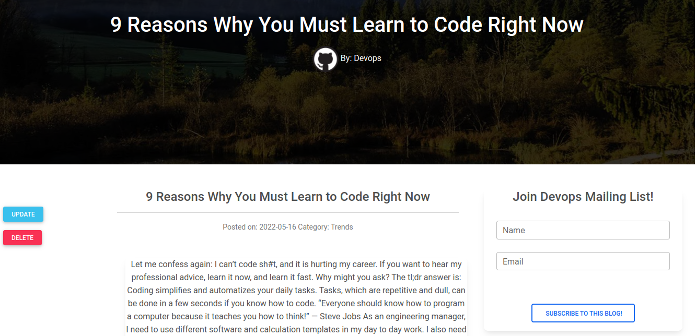

# The CODEBLOG!

## Description

An online web blog application that talks about code and things learnt so far. It consumes a quotes API. 

A user can subscribe to a blog and get notified via mail. The app is built on Flask framework.

## Live preview

You can view the site at: <https://the-code-blog.herokuapp.com/>

## Setup Instructions and Installation

- Clone this repository to a location in your file system. `git clone https://github.com/sirgama/Code-Blog.git`
- Open terminal command line then navigate to the root folder of the application. `cd Code-Blog
- Run `export FLASK_APP=run.py`

### Technologies Used

MDbootstrap 5,
python==3.9.10,
argcomplete==2.0.0,
Flask==1.1.4,
Flask-Script==2.0.6,
pip==20.0.2,

## Development

Would you love to contribute? Great!

To fix a bug or enhance an existing module, follow these steps:

- Fork the repo
- Create a new branch (git checkout -b improve-feature)
- Make the appropriate changes in the files
- Add changes to reflect the changes made
- Commit your changes (git commit -am 'Improve feature')
- Push to the branch (git push origin improve-feature)
- Create a Pull Request

## Known Bugs

If you find a bug (the website couldn't handle the query and or gave undesired results), kindly open an issue here by including your search query and the expected result.

If you'd like to request a new function, feel free to do so by opening an issue here. Please include sample queries and their corresponding results.

## Authors

Gamaliel Sirengo
Telegram: <https://t.me/sirgama>

### License

_MIT_
Copyright (c) 2022 **Gamaliel Sirengo**

Permission is hereby granted, free of charge, to any person obtaining a copy of this software and associated documentation files (the "Software"), to deal in the Software without restriction, including without limitation the rights to use, copy, modify, merge, publish, distribute, sublicense, and/or sell copies of the Software, and to permit persons to whom the Software is furnished to do so, subject to the following conditions:

The above copyright notice and this permission notice shall be included in all copies or substantial portions of the Software.

THE SOFTWARE IS PROVIDED "AS IS", WITHOUT WARRANTY OF ANY KIND, EXPRESS OR IMPLIED, INCLUDING BUT NOT LIMITED TO THE WARRANTIES OF MERCHANTABILITY, FITNESS FOR A PARTICULAR PURPOSE AND NONINFRINGEMENT. IN NO EVENT SHALL THE AUTHORS OR COPYRIGHT HOLDERS BE LIABLE FOR ANY CLAIM, DAMAGES OR OTHER LIABILITY, WHETHER IN AN ACTION OF CONTRACT, TORT OR OTHERWISE, ARISING FROM, OUT OF OR IN CONNECTION WITH THE SOFTWARE OR THE USE OR OTHER DEALINGS IN THE SOFTWARE.
